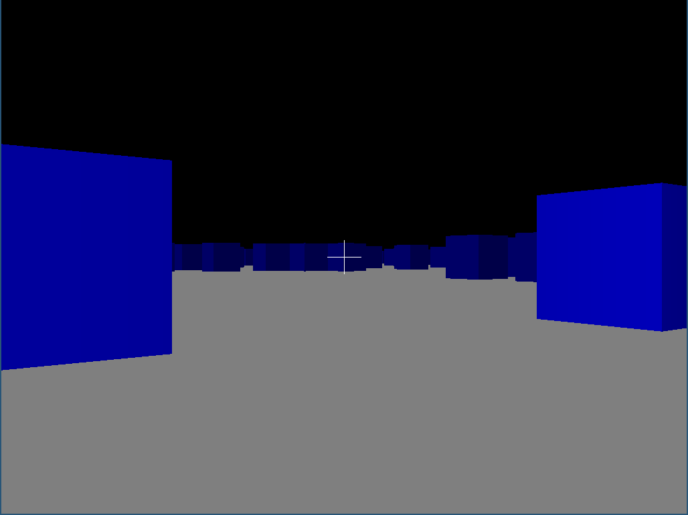

# Overview

A toy game similar to Wolfenstein 3D written purely for educational purpose, to
learn Rust and play with some advanced techniques.

The game doesn't use any hardware acceleration, all the rendering and other
calculations are done by the code itself.

Here is a screenshot:

# Description

A player walks on a randomly generated field. Player can move through walls.

Controls: W,A,S,D. Esc to exit.

# Features

- Wolfenstein 3D-like raytracer without textures. Just solid colors
  with shading
- No optimizations. Postponed to the future

# Installation

The game needs libsdl2 and libsdl2-dev:

For Ubuntu:

> sudo apt install libsdl2-dev

To run the game:

> cargo run

# Future plans

- [ ] Collision detection
- [ ] Nice random maps with rooms
- [ ] Some game elements